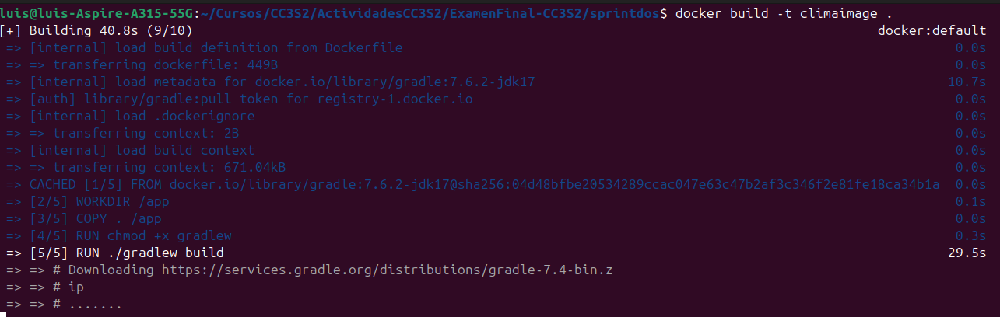
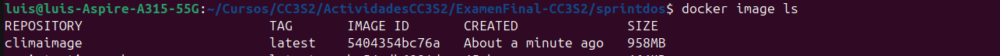
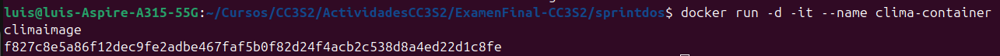

# Sprint 2

## Creando el Dockerfile

Creamos el Dockerfile de la siguiente manera:

```dockerfile
FROM gradle:7.6.2-jdk17

# establecemos el directorio de trabajo
WORKDIR /app

# copiamos los archivos al directorio de trabajo
COPY . /app

# Dar permisos de ejecución al Gradle Wrapper
RUN chmod +x gradlew

# Compilar el proyecto y ejecutar las pruebas usando el Gradle Wrapper
RUN ./gradlew build

# Ejecutar el programa compilado
CMD ["java", "-cp", "build/classes/java/main", "org.example.Main"]
```

Ahora construimos la imagen tomando en cuenta el Dockerfile

`docker build -t climaimage .`

Esperamos que termine de descargar lo necesario para construir nuestra imagen.



Ahora listamos nuestras imagenes para verificar que se haya creado exitosamente.

`docker image ls`



Creamos nuestro contenedor a partir de nuestra imagen `climaimage`

`docker run -d -it --name clima-container climaimage`

Como vemos nuestro contenedor se creó.



Veamos los logs del mismo.

`docker logs clima-container`