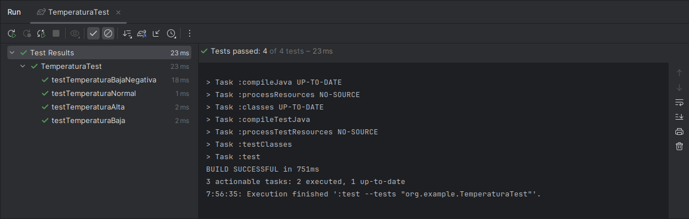

# Sprint 1

Nota: La entrada se considera tal cual se recomendó en el examen, primero se ingresa el valor de la temperatura, 
luego el valor del viento y luego el valor de la lluvia. La salida fue modificada según consideré, se mostrará un mensaje 
como se muestra en la siguiente imagen.

Ejemplo clima frio: Ingresa temperatura = 4, lluvia = 105, viento = 100


## Proceso TDD y SRP

### Clase Temperatura

La clase temperatura es la encargada de clasificar si la temperatura es baja, normal o alta.

Hacemos que la prueba falle

Código de producción, método esBaja()
```java
public boolean esBaja() {
        return false;
}
```
Código de test, método testTemperaturaBaja()
```java
@Test
    public void testTemperaturaBaja(){
        temperatura = new Temperatura(3);
        
        boolean result = temperatura.esBaja();
        
        assertTrue(result);
}
```

La siguiente imagen muestra que la prueba falló.


Hacemos que nuestra prueba pase

Código de producción, en el método esBaja() simplemente cambiamos el retorno por true.
```java
public boolean esBaja() {
        return true;
}
```
Código de test, método testTemperaturaBaja()
```java
@Test
    public void testTemperaturaBaja(){
        temperatura = new Temperatura(3);
        
        boolean result = temperatura.esBaja();
        
        assertTrue(result);
}
```

La siguiente imagen muestra que la prueba pasó, simplemente hemos cambiado el retorno por true.


Ahora por último refactorizamos.

Código de producción, en el método esBaja() vamos a considerar una temperatura baja cuando es menor a 5.
```java
public boolean esBaja() {
        return temperatura < 5;
}
```
Código de test, método testTemperaturaBaja()
```java
@Test
    public void testTemperaturaBaja(){
        temperatura = new Temperatura(3);
        
        boolean result = temperatura.esBaja();

        assertTrue(result, "Se espera que la temperatura sea baja.");
}
```

Seguimos este proceso para el método esNormal() y esAlta() de la clase Temperatura. Mostraré los test implementados.

```java
//test para verificar que la temperatura sea baja, menos que 5
    @Test
    public void testTemperaturaBaja(){
        temperatura = new Temperatura(3);

        boolean result = temperatura.esBaja();

        assertTrue(result, "Se espera que la temperatura sea baja.");
    }
    //test para verificar que la temperatura sea normal, entre 5 y 30
    @Test
    public void testTemperaturaNormal(){
        temperatura = new Temperatura(25);

        boolean result = temperatura.esNormal();

        assertTrue(result, "Se espera que la temperatura sea normal.");
    }
    //test para verificar que la temperatura sea alta, mayor 30
    @Test
    public void testTemperaturaAlta(){
        temperatura = new Temperatura(32);

        boolean result = temperatura.esAlta();

        assertTrue(result, "Se espera que la temperatura sea alta.");
    }
    //test para verificar que la temperatura sea baja para valores negativos
    @Test
    public void testTemperaturaBajaNegativa(){
        temperatura = new Temperatura(-1);

        boolean result = temperatura.esBaja();

        assertTrue(result, "Se espera que la temperatura sea baja.");
    }
```

Se muestra en la imagen que las pruebas pasa, implementamos 4 pruebas.



## Clase Viento

Se muestra a continuación los test para la clase Viendo, también se siguió el proceso TDD.

```java
//test para verificar que el viento sea moderado, menor que 40 km/h
@Test
public void testVientoModerado(){
    viento = new Viento(35);

    boolean result = viento.esBaja();

    assertTrue(result);
}
//test para verificar que el viento sea fuerte, entre 40 y 90 km/h
@Test
public void testVientoFuerte(){
    viento = new Viento(50);

    boolean result = viento.esNormal();

    assertTrue(result);
}
//test para verificar que el viento sea huracanado, mayor que 90 km/h
@Test
public void testVientoHuracanado(){
    viento = new Viento(120);

    boolean result = viento.esAlta();

    assertTrue(result);
}
```


## Clase Lluvia

Se muestra a continuación los test para la clase Lluvia, también se siguió el proceso TDD.

```java
//test para verificar que la lluvia sea baja, entre 20 y 50 mm
@Test
public void testLluviaLlovizna() {
    lluvia = new Lluvia(30);

    boolean result = lluvia.esBaja();

    assertTrue(result);
}
//test para verificar que la lluvia sea normal, entre 50 y 100 mm
@Test
public void testLluviaIntensa() {
    lluvia = new Lluvia(80);

    boolean result = lluvia.esNormal();

    assertTrue(result);
}
//test para verificar que la lluvia sea alta, mayor a 100 mm
@Test
public void testLluviaMuyIntensa() {
    lluvia = new Lluvia(150);

    boolean result = lluvia.esAlta();

    assertTrue(result);
}
```


## Utilizando Mockito

Tenemos una clase ClimaService que nos mostrará un mensaje dependiendo de las condiciones climáticas, se muestra a continuación
las consideraciones que se tuvo para cada mensaje.

Temperatura baja, lluvia alta y viento alto => "Tenemos un buen clima frio, abrigate."

Temperatura normal, viendo bajo y lluvia baja => "Tenemos un buen clima, disfruta el dia."

Temperatura alta, lluvia baja y viendo bajo => "Tenemos un clima caluroso, toma una bebida."

```java
public String tipoDeClima(){
        if (temperatura.esBaja() && lluvia.esAlta() && viento.esAlta()){
            return "Tenemos un clima frio, abrigate.";
        } else if (temperatura.esNormal() && lluvia.esBaja() && viento.esBaja()){
            return "Tenemos un buen clima, disfruta el dia.";
        } else if (temperatura.esAlta() && lluvia.esBaja() && viento.esBaja()){
            return "Tenemos un clima caluroso, toma una bebida.";
        }
        return "Tenemos un clima distinto, tomar precauciones.";
}
```

Tenemos 4 test de los cuales hemos utilizado Mocks y stubs, estos test verifican que se obtenga un clima frio, clima normal, clima caluroso y
un clima distinto según las condiciones que se mencionaron anteriormente. También estamos verificando que los métodos se llamen, por ejemplo:
verify(temperatura).esBaja() el cual verifica que se llame al método esBaja() del objeto Temperatura.

```java
@Mock
    IMedicionClimatica temperatura;
    @Mock
    IMedicionClimatica lluvia;
    @Mock
    IMedicionClimatica viento;
    @InjectMocks
    ClimaService climaService;

    @Test
    public void testClimaFrio() {
        when(temperatura.esBaja()).thenReturn(true);
        when(lluvia.esAlta()).thenReturn(true);
        when(viento.esAlta()).thenReturn(true);

        climaService = new ClimaService(temperatura, lluvia, viento);

        assertEquals("Tenemos un clima frio, abrigate.", climaService.tipoDeClima());

        //verificamos si los metodos se estan llamando correctamente
        verify(temperatura).esBaja();
        verify(lluvia).esAlta();
        verify(viento).esAlta();
    }

    @Test
    public void testClimaAgradable() {
        when(temperatura.esNormal()).thenReturn(true);
        when(lluvia.esBaja()).thenReturn(true);
        when(viento.esBaja()).thenReturn(true);

        climaService = new ClimaService(temperatura, lluvia, viento);

        assertEquals("Tenemos un buen clima, disfruta el dia.", climaService.tipoDeClima());

        //verificamos si los metodos se estan llamando correctamente
        verify(temperatura).esNormal();
        verify(lluvia).esBaja();
        verify(viento).esBaja();
    }

    @Test
    public void testClimaCaluroso() {
        when(temperatura.esAlta()).thenReturn(true);
        when(lluvia.esBaja()).thenReturn(true);
        when(viento.esBaja()).thenReturn(true);

        climaService = new ClimaService(temperatura, lluvia, viento);

        assertEquals("Tenemos un clima caluroso, toma una bebida.", climaService.tipoDeClima());

        //verificamos si los metodos se estan llamando correctamente
        verify(temperatura).esAlta();
        verify(lluvia).esBaja();
        verify(viento).esBaja();
    }

    @Test
    public void testClimaNormal() {
        climaService = new ClimaService(temperatura, lluvia, viento);

        assertEquals("Tenemos un clima distinto, tomar precauciones.", climaService.tipoDeClima());
    }
```

Se muestra a continuación que las pruebas pasaron satisfactoriamente.


## JaCoCo

Nos dirigimos a nuestra terminal para ejecutar el reporte de JaCoCo.
```shell
./gradlew clean
./gradlew build
./gradlew test
./gradlew jacocoTestReport
```


Ahora nos dirigimos hacia: `sprintuno/build/reports/jacoco/test/html` y abrimos el archivo `index.html`.

El reporte de JaCoCo nos muestra la cobertura de nuestro código, en este caso tenemos una cobertura de casi 100%
para cada una de nuestras clases a exepcion de la clase Main.


En cuanto a la cobertura de todo nuestro código tenemos una cobertura del 85%. Esto debido a que se incluye el método main.

