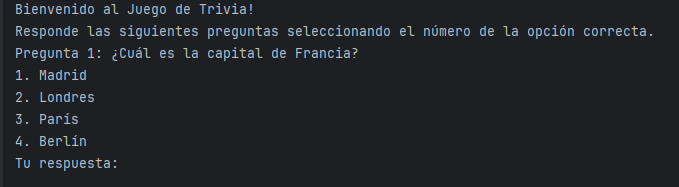
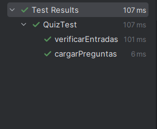

# Sprint 1

## Codigo de producción

Se configuró el entorno del proyecto y se desarrolló la lógica básica para la manipulación y
presentación de preguntas y respuestas.

## Codigo de test

Los códigos de prueba implementados son:
1. Carga de las preguntas, con sus respectivas alternativas y respuesta correcta
2. Se verificó que el usuario ingrese un valor entre 1-4

