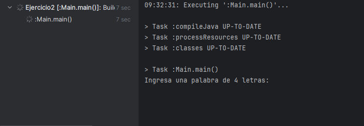
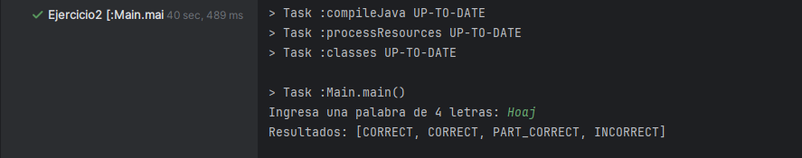
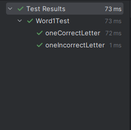

# Sprint 1

## Código de producción
1. Se implementó la clase Score1, Word1
2. Se puede jugar ingresando una palabra de 4 letras

Se muestra en consola el mensaje para ingresar una palabra

Se ingresa la palabra Hoaj, y se muestran los resultados, tener en cuenta que la palabra correcta es Hola

## Código de test
1. Se implementó el caso de prueba para una letra incorrecta
2. Se implementó el caso de prueba para una letra correcta

