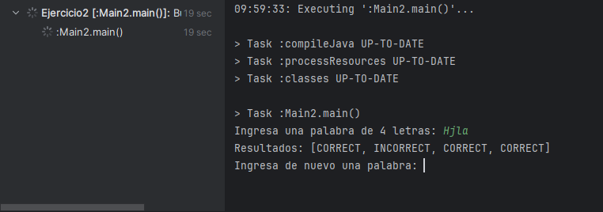
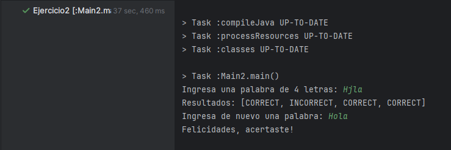
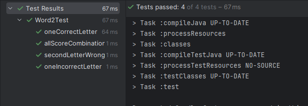

# Sprint 2
## Código de producción
1. Se implementó el juego para que este muestre las respuestas ingresadas por el usuario(retroalimentacion)
2. El juego no terminará si el usuario no ingresa todas las letras correctas.

La siguiente imagen muestra que el juego no termina y muestra los resultados

La siguiente imagen muestra que el juego termina si ingresas la palabra correcta: Hola

## Código de test
1. Se implementó el método de prueba secondLetterWrongPosition
2. Se implementó el método de prueba allScoreCombinations

