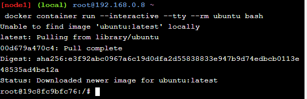
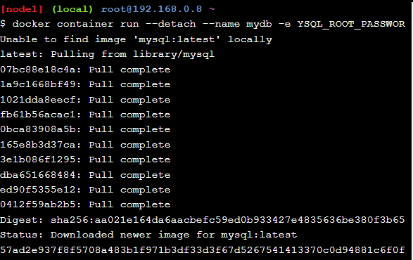
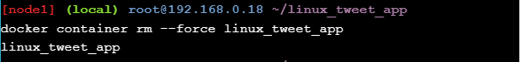
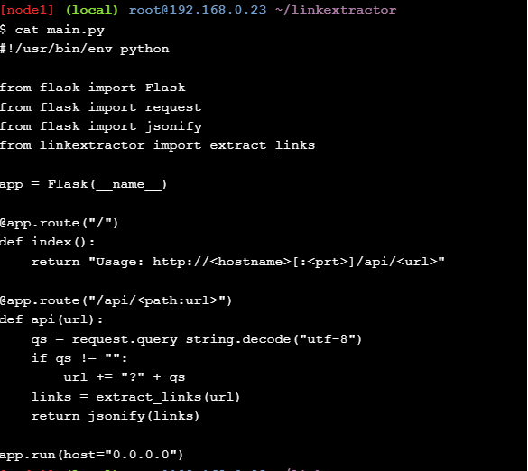
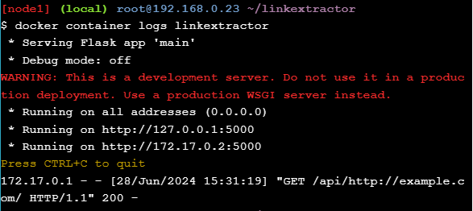
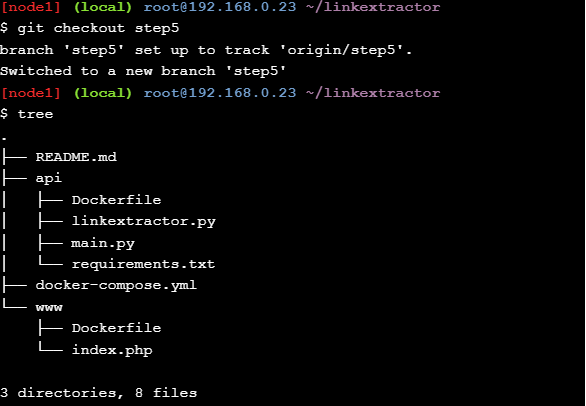
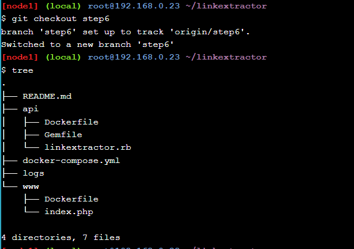

# Play With Docker Stage 1

## Docker for Beginners - Linux

## Tarea 0: requisitos previos

### Clonar el repositorio de GitHub del laboratorio
Clonamos el repositorio del laboratorio desde GitHub.

`git clone https://github.com/dockersamples/linux_tweet_app`


### Asegúrate de tener una DockerID
Nos registramos en Docker para obtener un DockerID: `luisjhonatan` en mi caso

## Tarea 1: ejecutar algunos contenedores Docker simples

### Ejecute una sola tarea en un contenedor Alpine Linux

`docker container run alpine hostname`


El siguiente resultado muestra que la imagen `alpine:latest` no se pudo encontrar localmente.\
Cuando esto sucede, Docker lo extrae automáticamente de Docker Hub.\
Después de extraer la imagen,ejecuta el comando `hostname` y muestra el nombre de host del\
contenedor (53f32e948d4b en el ejemplo).

`docker container ls --all`


Docker mantiene un contenedor en ejecución mientras el proceso que inició dentro del contenedor\
todavía esté ejecutándose. En este caso, el proceso de nombre `host` sale tan pronto como se escribe\
la salida. Esto significa que el contenedor se detiene. Sin embargo, Docker no elimina recursos de\
forma predeterminada, por lo que el contenedor aún existe.

### Ejecute un contenedor interactivo de Ubuntu

`docker container run --interactive --tty --rm ubuntu bash`

* --interactive (o -i): Esta opción mantiene la entrada estándar (stdin) abierta, lo que permite la interacción con el contenedor.
* --tty (o -t): Esta opción asigna una terminal pseudo-TTY, lo que permite que el contenedor proporcione una interfaz de línea de comandos interactiva.
* --rm: Esta opción elimina automáticamente el contenedor cuando se detiene, limpiando así los recursos utilizados.



Cuando se inicie el contenedor, accederá al shell bash con el mensaje predeterminado `root@<container id>:/#`\
Docker se ha conectado al shell en el contenedor, transmitiendo entrada y salida entre su sesión local y la\
sesión del shell en el contenedor.

`root@19c8fc9bfc76:/# ls `

`root@19c8fc9bfc76:/# ps aux`

`root@19c8fc9bfc76:/# cat /etc/issue`


Cuando ejecutamos los comandos anteriores en el contenedor obtenemos los resultados anteriores.

`root@<container id>:/# exit`


Escriba `exit` para salir de la sesión de shell. Esto finalizará el bashproceso y provocará que el contenedor salga.

`docker container ls -all`


Al listar todos los contenedores verificamos que el contenedor anterior fue eliminado por la bandera `--rm`.

Nota:  los contenedores de Linux requieren que el host Docker ejecute un kernel de Linux. Por ejemplo, los\
contenedores de Linux no pueden ejecutarse directamente en hosts de Windows Docker. Lo mismo ocurre con los\
contenedores de Windows: deben ejecutarse en un host Docker con un kernel de Windows.

### Ejecutar un contenedor MySQL en segundo plano

`docker container run --detach --name mydb -e MYSQL_ROOT_PASSWORD=my-secret-pw mysql:latest `

* --detach (o -d): Esta opción ejecuta el contenedor en segundo plano (modo detached).
* --name mydb: Esta opción asigna el nombre mydb al contenedor para facilitar su gestión.
* -e MYSQL_ROOT_PASSWORD=my-secret-pw: Esta opción establece la variable de entorno MYSQL_ROOT_PASSWORD\
dentro del contenedor, configurando la contraseña del usuario root de MySQL como my-secret-pw.



Como la imagen de MySQL no estaba disponible localmente, Docker la extrajo automáticamente de Docker Hub.\
Mientras el proceso MySQL esté en ejecución, Docker mantendrá el contenedor ejecutándose en segundo plano.

`docker container ls`


Observamos que el contenedor se está ejecutando.

`docker container logs mydb`

Esto muestra los registros del contenedor MySQL Docker.

`docker container top mydb`


Vemos que el demonio MySQL (mysqld) se está ejecutando en el contenedor.

`docker exec -it mydb mysql --user=root --password=$MYSQL_ROOT_PASSWORD --version`


Docker Container Exec le permite ejecutar un comando dentro de un contenedor. En este ejemplo, usaremos\
Docker Container Exec para ejecutar el equivalente de línea de comandos de mysql --user=root\
--password=$MYSQL_ROOT_PASSWORD --version dentro de nuestro contenedor MySQL.

`docker exec -it mydb sh`


También puede utilizar Docker Container Exec para conectarse a un nuevo proceso de shell dentro de\
un contenedor que ya se está ejecutando. Al ejecutar el siguiente anterior, obtendrá un shell\
interactivo (sh) dentro de su contenedor MySQL.

## Tarea 2: empaquetar y ejecutar una aplicación personalizada usando Docker

### Cree una imagen de sitio web simple
`cd ~/linux_tweet_app`


Nos dirigimos hacia el directorio `linux_tweet_app`.

`cat Dockerfile`


**Explicación del archivo Dockerfile**

* `FROM nginx:latest`
Esta línea especifica la imagen base que se utilizará para crear la nueva imagen Docker. En este caso, se está utilizando la imagen nginx en su versión más reciente (latest).

* `COPY index.html /usr/share/nginx/html`
Esta línea copia el archivo index.html desde tu sistema local al directorio /usr/share/nginx/html dentro del contenedor.

* `COPY linux.png /usr/share/nginx/html`
Esta línea copia el archivo linux.png desde tu sistema local al mismo directorio dentro del contenedor.

* `EXPOSE 80 443`
Esta línea indica que el contenedor escucha en los puertos 80 y 443.

* `CMD ["nginx", "-g", "daemon off;"]`
Esta línea especifica el comando que se ejecutará cuando se inicie el contenedor.

`export DOCKERID=luisjhonatan`

`echo $DOCKERID`


Definimos una variable de entorno `$DOCKERID` cuyo valor es `luisjhonatan`.

`docker imagen build --tag $DOCKERID/linux_tweet_app:1.0`


El comando `docker image build --tag $DOCKERID/linux_tweet_app:1.0 .` construye una imagen Docker a partir de un Dockerfile en el directorio actual y la etiqueta con un nombre y versión específicos, utilizando tu ID de Docker. Para mostrar las imagenes usamos `docker images`.

`docker container run --detach --publish 80:80 --name linux_tweet_app $DOCKERID/linux_tweet_app:1.0`

 * --publish 80:80 (o -p 80:80): Esta opción expone un puerto del contenedor al puerto del host.
 * 80:80: Esto significa que el puerto 80 del host se mapea al puerto 80 del contenedor. De este modo, cualquier tráfico que llegue al puerto 80 de tu máquina host se redirigirá al puerto 80 del contenedor, permitiendo que el servicio web dentro del contenedor sea accesible desde el exterior.


Utilizamos el comando de ejecución del contenedor Docker para iniciar un nuevo contenedor a partir de la imagen que creó.

 `docker container rm --force linux_tweet_app`



* --force (o -f): Esta opción fuerza la eliminación del contenedor incluso si está en ejecución. Sin esta opción, Docker no permite eliminar un contenedor que está corriendo; en lugar de eso, primero tendrías que detenerlo.

Nota: En un entorno de producción, es posible que desee utilizar `docker container stop` para detener correctamente el contenedor y dejarlo en el host. Luego puede usar `docker container rm` para eliminarlo permanentemente.

## Tarea 3: modificar un sitio web en ejecución

### Inicie nuestra aplicación web con un montaje vinculado

`docker container run --detach --publish 80:80 --name linux_tweet_app --mount type=bind,source="$(pwd)",target=/usr/share/nginx/html luisjhonatan/linux_tweet_app:1.0`

`cp index-new.html index.html`


Creamos y ejecutamos el contenedor con `docker container run` y luego reemplazamos el archivo `index.html` por `index-new.html`, obteniendo el resultado anterior.

### Actualizar la imagen

`docker image build --tag luisjhonatan/linux_tweet_app:2.0 .`

`docker image ls`


Para conservar los cambios que realizó en el archivo `index.html` de la imagen, debe crear una nueva versión de la imagen. Ahora tenemos una nueva versió con el fondo naranja y la antigua versión con el fondo azul.

### Envía tus imágenes a Docker Hub

`docker login`

`docker image push luisjhonatan/linux_tweet_app:1.0`

`docker image push luisjhonatan/linux_tweet_app:2.0`

Los comandos anteriores los utilizamos para enviar nuestra imagen a Docker Hub.

[Docker Hub-imagen](https://hub.docker.com/repositories/luisjhonatan)

## Contenedores de aplicaciones y orquestación de microservicios

## Configuración del escenario

`git clone https://github.com/ibnesayeed/linkextractor.git`

`cd linkextractor`

`git checkout demo`

Comencemos clonando primero el repositorio de códigos de demostración, cambiando el directorio de trabajo y verificando la rama demo.

## Paso 0: Script básico de extracción de enlaces

```
git checkout step0
tree
```


Consultamos la rama step0 y enumeramos los archivos que contiene.

`cat linkextractor.py`


Descripción: 

1. Importa los módulos necesarios:
   - `sys` para acceder a los argumentos de la línea de comandos.
   - `requests` para realizar solicitudes HTTP.
   - `BeautifulSoup` de `bs4` para analizar el contenido HTML.

2. Utiliza `requests.get(sys.argv[-1])` para realizar una solicitud HTTP GET a la URL proporcionada como último argumento en la línea de comandos. El resultado de esta solicitud se almacena en `res`.

3. Crea un objeto `BeautifulSoup` llamado `soup` para analizar el texto HTML de la respuesta (`res.text`), utilizando el analizador `"html.parser"`.

4. Itera sobre todos los elementos `<a>` (anclas/links) encontrados en el documento HTML analizado (`soup.find_all("a")`).

5. Para cada elemento `<a>` encontrado, imprime el valor de su atributo `href` usando `link.get("href")`. Este atributo `href` generalmente contiene la URL a la que apunta el enlace.

En resumen, este script toma una URL como argumento de la línea de comandos, descarga su contenido HTML, analiza este contenido para encontrar todos los enlaces y luego imprime las URLs de estos enlaces en la salida estándar.

`./linkextractor.py http://example.com/`


Cuando intentamos ejecutarlo como un script, obtuvimos el error Permiso denegado. Veamos los permisos:

`ls -l linkextractor.py`


Este permiso actual -rw-r--r-- indica que el script no está configurado para ser ejecutable. Por esta razon lo ejecutamos como un programa python:

`python3 linkextractor.py`


Aquí recibimos el primer mensaje ImportError porque nos falta el paquete de terceros que necesita el script. Podemos instalar ese paquete de Python (y potencialmente otros paquetes faltantes), pero es demasiado trabajo para un script tan simple.

## Paso 1: Script de extracción de enlaces en contenedores

```
git checkout step1
tree
```


Consultamos la rama step1 y mostramos los archivos que contiene.

`cat Dockerfile`


Descripción del Dockerfile:

Este Dockerfile crea una imagen de contenedor que tiene Python 3 y los paquetes necesarios (`beautifulsoup4` y `requests`) instalados, copia el script `linkextractor.py` al contenedor, lo hace ejecutable y configura el contenedor para ejecutar este script al iniciar.

`docker image build -t linkextractor:step1 .`

`docker image ls`


Hemos creado una iamgen de Docker con el nombre linkextractor:step1. La podemos visualizar en la imagen anterior.

`docker container run -it --rm linkextractor:step1 http://example.com/`


Ahora ejecutamos un contenedor único con esta imagen, el scrip nos devuelve un único enlace.

## Paso 2: Módulo extractor de enlaces con URI completo y texto ancla

```
git checkout step2
tree
```


Consultamos la rama step2 y mostramos los archivos que contiene.

`cat linkextractor.py`


En este paso, el script `linkextractor.py` se actualiza con los siguientes cambios funcionales:

* Las rutas están normalizadas a URL completas.
* Informar tanto de enlaces como de textos de anclaje
* Utilizable como módulo en otros scripts.

`docker image build -t linkextractor:step2 .`

`docker image ls`


Construimos una imagen `linkextractor:step2` y vemos que la imagen para `step1` pueden coexistir y los contenedores pueden usar cualquiera de estas imágenes.

`docker container run -it --rm linkextractor:step2 https://training.play-with-docker.com/`


Ahora la ejecución de un contenedor único utilizando la imagen `linkextractor:step2` deberia producir el resultado anterior. Comparado con el `step1` ahora tenemos por ejemplo, URL completas y ya no enlaces relativos.

## Paso 3: Servicio API Link Extractor

```
git checkout step3
tree
```


Consultamos la rama step3 y mostramos los archivos que contiene.

`cat Dockerfile`


Descripción:

1. `FROM python:3`: Usa la imagen oficial de Python 3 como base.

2. `LABEL maintainer="Sawood Alam <@ibnesayeed>"`: Asigna un mantenedor a la imagen.

3. `WORKDIR /app`: Establece `/app` como el directorio de trabajo en el contenedor.

4. `COPY requirements.txt /app/`: Copia el archivo `requirements.txt` al directorio de trabajo en el contenedor. Este archivo debe contener una lista de paquetes Python necesarios.

5. `RUN pip install -r requirements.txt`: Instala los paquetes Python especificados en `requirements.txt`.

6. `COPY *.py /app/`: Copia todos los archivos `.py` del directorio actual (en el contexto de construcción) al directorio de trabajo en el contenedor.

7. `RUN chmod a+x *.py`: Cambia los permisos de todos los archivos `.py` en el directorio de trabajo para hacerlos ejecutables.

8. `CMD ["./main.py"]`: Define el comando por defecto para ejecutar cuando el contenedor se inicie, que es ejecutar el script `main.py`.

En resumen, este Dockerfile prepara un entorno Python 3, instala dependencias definidas en `requirements.txt`, copia y hace ejecutables los scripts Python al contenedor, y configura el contenedor para ejecutar `main.py` al iniciar.

`cat main.py`



Aquí, importamos la función `extract_links` del módulo `linkextractor` y convertimos la lista de objetos devuelta en una respuesta JSON.

`docker image build -t linkextractor:step3 .`


Ahora construimos una imagen `linkextractor:step3`.

`docker container run -d -p 5000:5000 --name=linkextractor linkextractor:step3`

`docker container ls`


Ejecutamos un contenedor en segundo plano(bandera -d), mapeamos el puerto 5000 del host al puerto 5000 del contenedor(-p5000:5000) y le damos el nombre de linkextractor a nuestro contenedor.

`curl -i http://localhost:5000/api/http://example.com/`


Realizamos una solicitud HTTP en el formulario `/api/<url>` al servidor y vemos que tenemos una respuesta exitosa(200). Para ver lo que sucede con el contenedor tenemos que hacer:

`docker container logs linkextractor`



Podemos ver los mensajes registrados cuando se activó el servidor y una entrada del registro de solicitudes cuando ejecutamos el comando `curl`, esto quiere decir que hemos ejecutado con éxito un servicio API escuchando en el puerto 5000.

`docker container rm -f linkextractor`

Por último eliminamos nuestro contenedor.

## Paso 4: API de Link Extractor y servicios de interfaz web

```
git checkout step4
tree
```


Consultamos la rama step4 y mostramos los archivos que contiene.

En este paso se han realizado los siguientes cambios desde el último paso:

* El servicio API JSON del extractor de enlaces (escrito en Python) se mueve a una carpeta `./api` separada que tiene exactamente el mismo código que en el paso anterior.
* Una aplicación web front-end está escrita en PHP en la carpeta `./www` que se comunica con la API JSON.
* La aplicación PHP está montada dentro de la imagen oficial de Docker php:7-apache para facilitar su modificación durante el desarrollo.
* Se puede acceder a la aplicación web en `http://<hostname>[:<prt>]/?url=<url-encoded-url>`
* Se utiliza una variable de entorno API_ENDPOINT dentro de la aplicación PHP para configurarla para comunicarse con el servidor API JSON.
* Se escribe un archivo docker-compose.yml para construir varios componentes y unirlos.

Para este paso ejecutaremos dos contenedores separados, uno para la API y otro para la interfaz web. Vamos a utilizar Docker compose para automatizar las tareas.

`cat docker-compose.yml`


Este docker-compose.yml define dos servicios, api y web, para automatizar la creación y ejecución de contenedores Docker para una aplicación de extracción de enlaces con una interfaz web.

#### Servicio API:
* image: Se especifica el nombre de la imagen personalizada linkextractor-api:step4-python para el servicio API.
* build: La ubicación del Dockerfile y los archivos necesarios para construir la imagen del servicio API se encuentran en el directorio `./api`.
* ports: Mapea el puerto 5000 del contenedor al puerto 5000 del host, permitiendo el acceso al servicio API desde fuera del contenedor.

#### Servicio Web:
* image: Utiliza la imagen oficial php:7-apache para el servicio web. Esta imagen incluye PHP 7 y el servidor web Apache.
* ports: Mapea el puerto 80 del contenedor al puerto 80 del host, permitiendo el acceso a la aplicación web desde un navegador web mediante la dirección del host.
* environment: Define una variable de entorno API_ENDPOINT dentro del contenedor, configurándola para comunicarse con el servicio API en http://api:5000/api/. Docker Compose resuelve automáticamente el nombre api al IP del contenedor que ejecuta el servicio API.
* volumes: Monta el directorio `./www` del host en /var/www/html dentro del contenedor. Esto permite que el servidor web Apache sirva los archivos de la aplicación web PHP. Los cambios en el directorio ./www se reflejarán en tiempo real dentro del contenedor.

`docker-compose up -d --build`


Este resultado muestra que Docker Compose creó automáticamente una red llamada `linkextractor_default`, extrajo la imagen `php:7-apache` de DockerHub, creó la imagen `api:python` usando nuestro Dockerfile local y, finalmente, activó dos contenedores `linkextractor_web_1` y `linkextractor_api_1` que corresponden a los dos servicios que tenemos.

`curl -i http://localhost:5000/api/http://example.com/`


Como vemos podemos hablar con el servidor API como en el step3.


En nuestra interfaz gráfica completamos el formulario con `https://training.play-with-docker.com/` y notamos que nos extrae todos los enlaces como se esperaba.

Con esto, acabamos de crear una aplicación con arquitectura de microservicio, aislando tareas individuales en servicios separados en lugar de aplicaciones monolíticas donde todo se reúne en una sola unidad. Las aplicaciones de microservicios son relativamente más fáciles de escalar, mantener y mover. También permiten un fácil intercambio de componentes con un servicio equivalente. 

`docker-compose down`

Por último cerramos todos los servicios con la instrucción anterior.

## Paso 5: Servicio Redis para almacenamiento en caché

```
git checkout step5
tree
```



Consultamos la rama step5 y mostramos los archivos que contiene.

Algunos cambios notables con respecto al paso anterior son los siguientes:

* Se agrega otro Dockerfile en la carpeta `./www` para que la aplicación web PHP cree una imagen autónoma y evite el montaje de archivos en vivo.
* Se agrega un contenedor Redis para almacenamiento en caché usando la imagen oficial de Redis Docker
* El servicio API se comunica con el servicio Redis para evitar descargar y analizar páginas que ya se eliminaron antes.
* Se agrega una variable de entorno REDIS_URL al servicio API para permitirle conectarse al caché de Redis.

`cat www/Dockerfile`


Este es un Dockerfile bastante simple que utiliza la imagen oficial de php:7-apache como base y copia todos los archivos de la carpeta `./www` en la carpeta `/var/www/html/` de la imagen. Esto es exactamente lo que estaba sucediendo en el paso anterior, pero se montó mediante enlace usando un volumen, mientras que aquí hacemos que el código forme parte de la imagen independiente. También agregamos aquí la variable de entorno `API_ENDPOINT` con un valor predeterminado, lo que implícitamente sugiere que esta es una información importante que debe estar presente para que el servicio funcione correctamente (y debe personalizarse en tiempo de ejecución con un valor apropiado).

`cat api/main.py`


Esta vez, el servicio API necesita saber cómo conectarse a la instancia de Redis, ya que la utilizará para el almacenamiento en caché. Esta información puede estar disponible en tiempo de ejecución utilizando la variable de entorno REDIS_URL. También se agrega una entrada ENV correspondiente en el Dockerfile del servicio API con un valor predeterminado.

Se crea una instancia de cliente Redis utilizando el nombre de host redis (el mismo que el nombre del servicio, como veremos más adelante) y el puerto predeterminado de Redis 6379. Primero intentamos ver si hay un caché presente en el almacén de Redis para una URL determinada. De lo contrario, usamos la función extract_links como antes y llenamos el caché para futuros intentos.

`cat docker-compose.yml`


Este `docker-compose.yml` define tres servicios para una aplicación compuesta por un servicio API, una interfaz web y un servicio de Redis para el almacenamiento en caché:

#### Servicio API:
- **image**: Usa una imagen personalizada `linkextractor-api:step5-python`.
- **build**: Construye la imagen del servicio API desde el directorio `./api`.
- **ports**: Mapea el puerto 5000 del contenedor al puerto 5000 del host.
- **environment**: Define `REDIS_URL` para conectar el servicio API con Redis en `redis://redis:6379`.

#### Servicio Web:
- **image**: Usa una imagen personalizada `linkextractor-web:step5-php`.
- **build**: Construye la imagen del servicio web desde el directorio `./www`.
- **ports**: Mapea el puerto 80 del contenedor al puerto 80 del host.
- **environment**: Define `API_ENDPOINT` para que el servicio web se comunique con el servicio API en `http://api:5000/api/`.

#### Servicio Redis:
- **image**: Usa la imagen oficial de Redis.

Este archivo configura una aplicación con un backend en Python que se comunica con Redis para el almacenamiento en caché y un frontend en PHP, todo orquestado con Docker Compose para facilitar el despliegue y la escalabilidad.

`docker-compose up -d --build`


Ahora que los tres servicios están activos, accedemos a la interfaz web. No hay ninguna diferencia visual con respecto al paso anterior. Sin embargo, si extraemos enlaces de una página con muchos enlaces, la primera vez lleva más tiempo, pero los intentos sucesivos a la misma página devueven la respuesta con bastante rapidez.

`docker-compose down`

Por último cerramos todos los servicios con la instrucción anterior.

## Paso 6: intercambie el servicio API de Python con Ruby

```
git checkout step6
tree
```



Consultamos la rama step6 y mostramos los archivos que contiene.

Algunos cambios significativos con respecto al paso anterior incluyen:

* El servicio API escrito en Python se reemplaza con una implementación similar de Ruby
* La variable de entorno API_ENDPOINT se actualiza para apuntar al nuevo servicio API de Ruby.
* El evento de caché de extracción de enlaces (HIT/MISS) se registra y persiste mediante volúmenes

Tenga en cuenta que la carpeta `./api` no contiene ningún script de Python; en cambio, ahora tiene un archivo Ruby y un `Gemfile` para administrar las dependencias.

`cat docker-compose.yml`


Este `docker-compose.yml` define una aplicación con tres servicios: un servicio API en Ruby, una interfaz web en PHP, y un servicio de Redis:

#### Servicio API:
- **image**: Usa una imagen personalizada `linkextractor-api:step6-ruby`.
- **build**: Construye la imagen desde el directorio `./api`.
- **ports**: Mapea el puerto 4567 del contenedor al puerto 4567 del host.
- **environment**: Configura `REDIS_URL` para conectar con Redis en `redis://redis:6379`.
- **volumes**: Monta un volumen local `./logs` en `/app/logs` dentro del contenedor para persistir los registros.

#### Servicio Web:
- **image**: Usa una imagen personalizada `linkextractor-web:step6-php`.
- **build**: Construye la imagen desde el directorio `./www`.
- **ports**: Mapea el puerto 80 del contenedor al puerto 80 del host.
- **environment**: Configura `API_ENDPOINT` para que el servicio web se comunique con el servicio API en `http://api:4567/api/`.

#### Servicio Redis:
- **image**: Usa la imagen oficial de Redis.

Este archivo configura una aplicación con un backend en Ruby que se comunica con Redis para el almacenamiento en caché y un frontend en PHP, facilitando el despliegue y la escalabilidad con Docker Compose.

`docker-compose up -d --build`


Ejecutamos el contenedor y accedemos a la página web para extraer algunos enlaces. En este caso ingresamos la página de wikipedia y vemos que extrajo los enlaces. Notamos que la aplicación web se comporta como antes, a pesar que se cambio el servicio API.

## Conclusiones

La sección final muestra cómo ejecutar los contenedores con `docker-compose up -d --build` y verifica el funcionamiento de la aplicación mediante el acceso a una interfaz web que extrae enlaces de una página de Wikipedia. A pesar de los cambios en el servicio API, la aplicación web se comporta como antes, demostrando la efectividad de la configuración y el despliegue con Docker Compose.

**Conclusiones:**

1. **Docker Compose facilita el despliegue y la escalabilidad:** La configuración de múltiples servicios en un solo archivo `docker-compose.yml` simplifica el proceso de despliegue y gestión de aplicaciones compuestas por varios contenedores.

2. **Separación de responsabilidades:** Cada servicio (API en Ruby, interfaz web en PHP, y Redis) se configura de manera independiente, lo que permite una clara separación de responsabilidades y facilita la escalabilidad y mantenimiento de cada componente.

3. **Persistencia de datos y configuración mediante variables de entorno:** El uso de volúmenes y variables de entorno permite una gestión eficiente de los datos y la configuración necesaria para la comunicación entre servicios, como la conexión entre el servicio API y Redis.

4. **Flexibilidad y facilidad de prueba:** La capacidad de construir imágenes personalizadas y mapear puertos específicos facilita las pruebas y el desarrollo local, permitiendo a los desarrolladores simular el entorno de producción de manera eficiente.

5. **Comprobación de funcionalidad:** La ejecución final de la aplicación y la verificación de su funcionamiento mediante la extracción de enlaces de una página web demuestra la efectividad de la configuración con Docker Compose, asegurando que los cambios en los servicios no afecten la funcionalidad general de la aplicación.


## Swarm stack introduction

### La aplicación

La aplicación de votación es una aplicación de contenedores múltiples muy útil que se utiliza a menudo con fines de demostración durante reuniones y conferencias.

Básicamente, permite a los usuarios votar entre gato y perro (pero también podría ser "espacio" o "tabulación" si lo desea).

### Inicia tu swarm

`docker swarm init --advertise-addr $(hostname -i)`


En nuestro primer terminal creamos un Docker Swarm. Copiamos el comando de "unión" y lo pegamos en el segundo terminal.

`docker swarm join --token SWMTKN-1-4zgcmvpj87ki3lznbo0u9dh08lx0lowz7idcx4i2mjzmx53lja-aq3x0vphk4irmxdpa1dmw1i4l 192.168.0.13:2377`


Luego de pegarlo, obtenemos el resultado anterior.

### Mostrar miembros del swarm

`docker node ls`


Verificamos la cantidad de nodos del swarm desde el primer terminal, observamos que tenemos 2 nodos. Siendo el primero manager y el segundo worker.

### Clonar la aplicación de votación

```
git clone https://github.com/docker/example-voting-app
cd example-voting-app
```

Clonamos la aplicación en la primera terminal(nodo manager).

### Implementar una pila

Una pila es un grupo de servicios que se implementan juntos. El docker-stack.yml en la carpeta actual se usará para implementar la aplicación de votación como una pila.

`docker stack deploy --compose-file=docker-stack.yml voting_stack`


Implementamos la pila con el comando anterior en la primera terminal(nodo manager).

`docker stack ls`


El resultado indica que se han implementado los 5 servicios de la pila de la aplicacion de votación.

`docker stack services voting_stack`


La imagen anterior comprueba que el servicio dentro de la pila está ejecutandose.

`docker service ps voting_stack_vote`


Ahora enumeramos las tareas del servicio de votación. En la columna NODO, podemos ver que se ejecuta una tarea para cada nodo.

Finalmente observamos que nuestra página está en funcionamiento.


Si votamos por "Dogs", la página de resultados nos muestra:


## Conclusión

Usar solo un par de comandos permite implementar una pila de servicios en Docker Swarm usando el excelente formato de archivo Docker Compose.