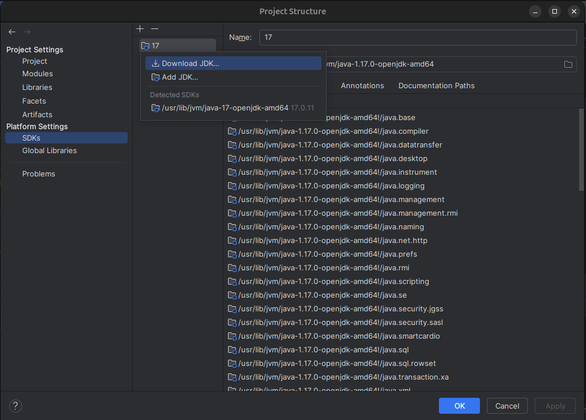

# Play With Docker - Stage 2

## Configuración inicial

Clonamos el repositorio haciendo:

`git clone https://github.com/docker/labs`

Luego nos dirigimos hacia la carpeta `labs/developer-tools/java-debugging` y 
abrimos un proyecto con intellij IDEA de la carpeta `app`.


Nota: Debemos contar con java 1.8 para poder correr nuestro programa. Si aún no lo has configurado realiza los siguientes pasos:

Dirígete a `FIle -> Project Structure -> SDKs`



Aquí le damos a  `+`, se desplegará la pestaña para elegir si deseas agregar o descargar un jdk. En mi caso le daré a descargar.


Elegimos la versión 1.8 de java, la descargamos y le damos en `Apply`. Con esto configuramos nuestro proyecto con java 1.8.

## Construyendo la aplicación

Nos dirigimos al panel de `maven`.


En `clean` le damos click derecho `Run UserSingUp[clean]`


Luego nos dirigimos hacia `install` le damos click derecho `Run UserSingUp[install]`


Con esto deberiamos haber construido nuestra aplicación de manera exitosa.

## Ejecutando la aplicación

### Revisando el docker-compose.yaml

```yaml
version: "2"

services:

  database:
    build:
      context: ./registration-database
    image: registration-database
    environment:
      MYSQL_ROOT_PASSWORD: password
    ports:
      - "3306:3306" 
    restart: always

  webserver:
    build: 
      context: ./registration-webserver
    image: registration-webserver
    volumes:
      - ./app/target/UserSignup:/usr/local/tomcat/webapps/UserSignup
    links:
      - database:registration-database
    ports:
      - "8080:8080" 
      - "8000:8000"
    restart: always
```

Descripción:

- **database**: 
    - Se construye a partir de un Dockerfile en el directorio `./registration-database`.
    - Usa la imagen `registration-database`.
    - Establece una variable de entorno `MYSQL_ROOT_PASSWORD` con el valor `password`.
    - Expone el puerto `3306` del host como del contenedor.
    - Se reinicia automáticamente siempre.

- **webserver**:
    - Se construye a partir de un Dockerfile en el directorio `./registration-webserver`.
    - Usa la imagen `registration-webserver`.
    - Monta un volumen que mapea `./app/target/UserSignup` del host a `/usr/local/tomcat/webapps/UserSignup` dentro del contenedor.
    - Establece un enlace al servicio `database`, permitiendo que se refiera a él como `registration-database`.
    - Expone los puertos `8080` y `8000` del host como del contenedor.
    - Se reinicia automáticamente siempre.

Este archivo configura un entorno con una base de datos y un servidor web, donde el servidor web puede acceder a la base de datos y ambos servicios están configurados para reiniciarse automáticamente.

`docker compose up`


Nota: La imagen anterior muestra un Warning debido a que nuestro archivo `docker-compose.yaml` está usando una versión antigua(2) pero no habrá problemas.

Nos dirigimos hacia: [http://localhost:8080](http://localhost:8080/).


Aquí podemos visualizar la página de TomCat. Lo que indica que nuestro archivo `docker-compose.yaml` logró crear con exito nuestros contenedores. 

Click en `Manager App`


Cuando la imagen de Tomcat fue construida, los roles de los usuarios fueron configurados. Haciendo click en el botón Manager App para visualizar las aplicaciones desplegadas se muestra lo anterior.

Nota: Las credenciales para poder iniciar sesión son las siguientes.

```
Credenciales: 

Usuario: system
Contraseña: manager
```

Ahora nos dirigimos hacia nuestra página principal: [http://localhost:8080/UserSignup/](http://localhost:8080/UserSignup/)


## Depurando la aplicación

Nos dirigimos hacia `Signup` y nos registramos.


Ahora iniciamos sesión con nuestra cuenta creada.


Como podemos ver, nos dice que no podemos iniciar sesión.


## Configurando depuración remota

Tomcat soporta depuración remota usando Java Platform Debugger Architecture (JPDA). Debug Remoto fue habilitado cuando la imagen tomcat (registration-webserver) fue construida.

Para configurar la depuración remota en IntelliJ, clic en `Run -> Edit Configuration` y se nos desplegará la siguiente pestaña.


Dentro de ella en la parte superior izquierda click en `+` y buscamos la opción `Remote JVM Debug`.


Ahora en la ventana emergente configuramos.

```
Name: docker tomcat
Port: 8000
```
Click en apply y listo.


## Buscando el error

Dado que el problema es la contraseña, veamos como la contraseña se establece en la clase User. En la clase User, el setter para la contraseña es mezclado usando rot13 antes de ser almacenado en la base de datos.


Ahora elegimos un punto de ruptura en el método `setPassword()`.


Elegimos la depuración remota de Tomcat como se muestra en la imagen siguiente.

Registramos un usuario `Movy` con contraseña `mOby`, después de registrar la página se quedará como muestra la siguiente imagen.


Ahora nos dirigimos hacia intellij IDEA y observamos que nuestra contraseña en `mOby`


Le damos click en `Resume Program` para permitir ejecutar el código.


A continuación, establecer el punto de interrupción en getPassword en la clase User para ver los valores retornados para la contraseña.


Tratamos de acceder a la página teniendo en cuenta que:

```
User: Moby
Password: mOvy
```


En intellij IDEA observamos que el valor de la contraseña es `z0ol` el cual debería ser `m0by` usando ROT13.


Nota: En esta aplicación MVC el `UserController` usa el método `findByLogin()` en la clase `UserServiceImpl` la cual usa el método `findByUsername()` para recuperar la información de la base de datos. 

A continuación, verificar que la contraseña del formulario coincide con la contraseña del usuario. Dado que la contraseña del formulario de inicio de sesión no es mezclada usando ROT13, este no coincide con la contraseña del usuario y no es posible acceder a la aplicación.

Para solucionar esto, aplicar ROT13 a la contraseña agregando

```
import com.docker.UserSignup.util.Rot13

String passwd = Rot13.rot13(password);
```


Con estos cambios establecer el punto de interrupción en el método `findByLogin()` de la clase `UserServiceImpl`.


Ahora tratamos de iniciar sesión y verificamos los valores en intellij IDEA.


Como podemos ver los valores son los correctos. Y pudimos iniciar sesión correctamente.


