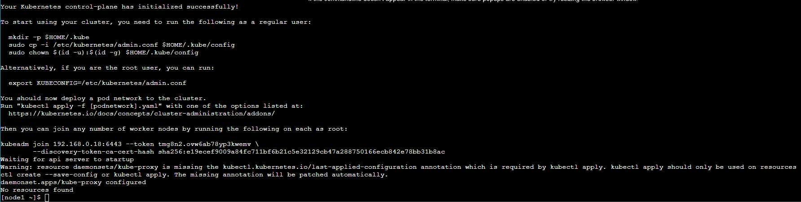
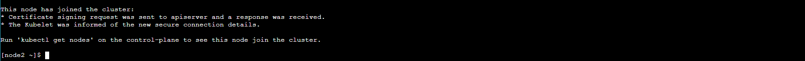
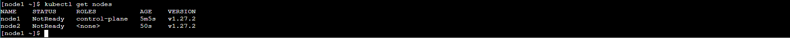
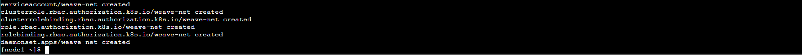
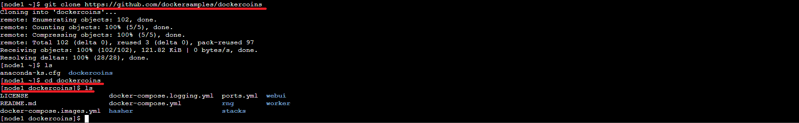
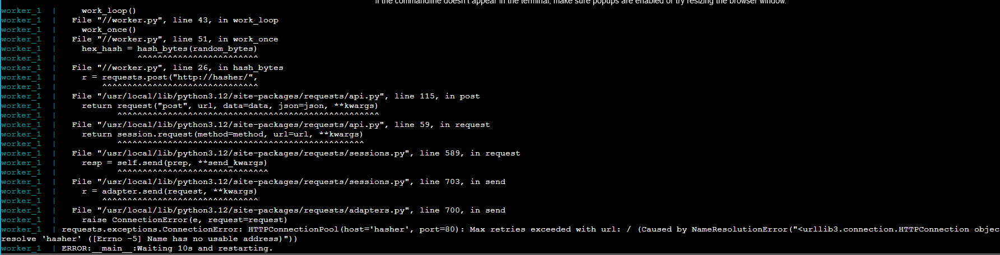

# Play With Kubernetes

## Iniciar el cluster

`kubeadm init --apiserver-advertise-address $(hostname -i)`



Primero iniciamos el cluster en la primera terminal(nodo master).

```
kubeadm join 192.168.0.18:6443 --token tmg8n2.ovw6ab78yp3kwemv \
        --discovery-token-ca-cert-hash sha256:e19ecef9009a84fc711bf6b21c5e32129cb47a288750166ecb842e78bb31b8ac
```



Copiamos la instrucción anterior en la segunda terminal(nodo worker), esto es resultado de haber iniciado el cluster en la primera terminal.

`kubectl get nodes`



Para comprobar que ambos nodos están conectados ejecutamos la instrucción anterior y podemos ver ambos nodos.

`kubectl apply -f https://github.com/weaveworks/weave/releases/download/v2.8.1/weave-daemonset-k8s-1.11.yaml`



Por último inicializamos la red del cluster en la primera terminal.

Con esto hemos terminado de configurar nuestro cluster.

## ¿Qué es esta aplicación?

...

## Obtener el código fuente de la aplicación

Diseño general del código fuente:

Hay un archivo de redacción `docker-compose.yml` y otros 4 servicios, cada uno en su propio directorio:

**rng** = servicio web que genera bytes aleatorios.

**hasher** = hash informático del servicio web de datos publicados

**worker** = proceso en segundo plano usando **rng** y **hasher**

**webui** = interfaz web para ver el progreso

`git clone https://github.com/dockersamples/dockercoins`

`cd dockercoins`

`ls`



Primero clonamos el repositorio, nos dirigimos hacia **dockercoind** y listamos su contenido para verificarlo.

## Ejecutando la aplicación

`docker-compose up`

Como sabemos compose le dice a Docker que construya todas las imágenes de contenedores, luego inicia todos los contenedores y muestra registros agregados.

## Muchos registros

* La aplicación genera registros continuamente.
* Podemos ver el servicio del trabajador realizando solicitudes a rng y hasher.

## Connecting to the web UI



<hr>

## Conceptos de Kubernetes

Kubernetes es un sistema de orquestación de contenedores que automatiza la implementación, escalabilidad y gestión de contenedores. Fue diseñado originalmente por Google y ahora es mantenido por la Fundación de Computación Nativa en la Nube (CNCF).

### Cosas básicas que podemos pedirle a Kubernetes

Kubernetes nos permite:

* **Ejecutar contenedores**: Podemos pedirle a Kubernetes que ejecute un contenedor para nosotros, y se asegurará de que el contenedor esté en ejecución y sea saludable.
* **Escalar contenedores**: Podemos pedirle a Kubernetes que escale nuestros contenedores hacia arriba o hacia abajo, según la carga.
* **Administrar el ciclo de vida de los contenedores**: Kubernetes puede administrar el ciclo de vida de nuestros contenedores, incluyendo el inicio, parada y reinicio según sea necesario.

## Otras cosas que Kubernetes puede hacer por nosotros

Kubernetes también puede:

* **Proporcionar balanceo de carga**: Kubernetes puede distribuir el tráfico entrante entre múltiples contenedores, asegurándose de que ningún contenedor individual se sature.
* **Proporcionar auto-sanación**: Si un contenedor falla, Kubernetes puede reiniciar automáticamente o reemplazarlo con uno nuevo.
* **Proporcionar gestión de recursos**: Kubernetes puede administrar los recursos (como CPU y memoria) asignados a nuestros contenedores.

## Arquitectura de Kubernetes

La arquitectura de Kubernetes consta de dos componentes principales: el **master** y los **nodos**.

### Arquitectura de Kubernetes: El master

El **master** es el componente central de Kubernetes que administra el clúster. Consiste en:

* Servidor de API: El servidor de API es el punto de entrada para todas las solicitudes al clúster de Kubernetes.
* Administrador de controladores: El administrador de controladores es responsable de ejecutar y administrar los componentes del plano de control.
* Programador: El programador es responsable de programar contenedores en nodos disponibles.

### Arquitectura de Kubernetes: Los Nodos

Los nodos son las máquinas que ejecutan nuestros contenedores. Cada nodo consiste en:

* Un motor de contenedores, normalmente Docker.
* Kubelet: El kubelet es el agente que se ejecuta en cada nodo y se comunica con el maestro.
* Tiempo de ejecución de contenedores: El tiempo de ejecución de contenedores es responsable de ejecutar los contenedores en el nodo.

## Recursos de Kubernetes

Los recursos de Kubernetes son objetos que son administrados por Kubernetes. Ejemplos de recursos incluyen:

* Pods: Un pod es la unidad de ejecución básica en Kubernetes y puede contener uno o más contenedores.
* Namespace: Los namespaces son esenciales para la organización y gestión de recursos dentro de un clúster, proporcionando aislamiento, gestión de recursos y simplificación administrativa. 
* Servicios: Un servicio es una abstracción lógica sobre un conjunto de pods que define una interfaz de red y un conjunto de políticas de punto final.
* Despliegues: Un despliegue es una forma de administrar la implementación de nuevas versiones de una aplicación.

## Declarativo vs Imperativo en Kubernetes

En Kubernetes, la configuración declarativa es el enfoque recomendado, ya que permite a Kubernetes administrar los recursos y asegurarse de que se logre el estado deseado.

* Prácticamente todo lo que creamos en Kubernetes se crea a partir de un **spec**.
* En Kubernetes, podemos definir una configuración declarativa utilizando archivos YAML o JSON.
* El **spec** define cómo queremos que sea la cosa.
* Cuando queremos actualizar algún recurso actualizamos el **spec**.

## Modelo de red Kubernetes

Nuestro clúster (nodos y pods) es una gran red IP plana.

* En detalle:
    * todos los nodos deben poder comunicarse entre sí, sin NAT

    * todos los pods deben poder comunicarse entre sí, sin NAT

    * Los pods y los nodos deben poder comunicarse entre sí, sin NAT.

    * cada pod conoce su dirección IP (sin NAT)

* Kubernetes no exige ninguna implementación en particular.

### Modelo de red de Kubernetes: lo bueno

* Todo puede llegar a todo.
* Sin traducción de dirección
* Sin traducción de puerto
* Sin nuevo protocolo
* Los pods no pueden moverse de un nodo a otro y conservar su dirección IP
* Las direcciones IP no tienen que ser "portátiles" de un nodo a otro (podemos usar, por ejemplo, una subred por nodo y una topología de enrutamiento simple)
* La especificación es lo suficientemente simple como para permitir muchas implementaciones diferentes.

### Modelo de red de Kubernetes: el menos bueno

* Todo puede llegar a todo.
* Si quieres seguridad, necesitas agregar políticas de red.
* la implementación de red que utiliza debe admitirlos
* Existen literalmente docenas de implementaciones (15 se enumeran en la documentación de Kubernetes)
* Parece que tiene una red de nivel 3, pero solo es de nivel 4 (la especificación requiere UDP y TCP, pero no rangos de puertos ni paquetes IP arbitrarios)
* kube-proxy está en la ruta de datos cuando se conecta a un pod o contenedor, y no es particularmente rápido (depende del proxy del usuario o iptables)

## Primer contacto con **kubectl**

`kubectl` es una herramienta de línea de comandos para interactuar con clústeres de Kubernetes. Permite a los usuarios ejecutar comandos en clústeres de Kubernetes, gestionar recursos del clúster, y realizar tareas de administración y depuración.

### kubectl get

`kubectl get no`

`kubectl get node`

`kubectl get nodes`

Estos comandos son equivalentes y se utilizan para obtener información sobre los nodos (nodes) que forman parte del clúster Kubernetes.

`kubectl describe type/name`

* Este comando proporciona una descripción detallada de un recurso específico en Kubernetes.
* `type` es el tipo de recurso (por ejemplo, pod, deployment, service, etc.).
* `name` es el nombre específico del recurso que deseas describir.

Por ejemplo, `kubectl describe pod/my-pod` te dará una descripción detallada del pod llamado my-pod, incluyendo su estado actual, eventos relacionados, configuración y más.

`kubectl explain type`

* Este comando proporciona una explicación detallada de los campos disponibles en un tipo de recurso específico en Kubernetes.
* `type` es el tipo de recurso sobre el cual deseas obtener información detallada.

Por ejemplo, `kubectl explain pod` te dará una descripción de todos los campos y configuraciones posibles que puedes utilizar al definir un pod en Kubernetes. Esto incluirá los campos obligatorios, opcionales y sus descripciones.

## Servicios

Un servicio en Kubernetes actúa como un punto de entrada estable y confiable para acceder a una aplicación desplegada, facilitando la comunicación entre componentes dentro del clúster y permitiendo la exposición controlada hacia el exterior según sea necesario.

`kubectl get svc`
`kubectl get services`

Ambos comandos en Kubernetes son equivalentes y se utilizan para obtener información sobre los servicios desplegados en el clúster.

## Contenedores de ejecución de la lista

`kubectl get pods`

Se utiliza para supervisar y gestionar los pods en el clúster, proporcionando una visión rápida del estado y detalles básicos de los pods desplegados.

## Namespaces

Los namespaces son una forma de organizar y gestionar recursos dentro de un clúster Kubernetes. Proporcionan un mecanismo de aislamiento y segmentación que permite a los usuarios dividir un clúster físico en múltiples clústeres virtuales, cada uno con su propio conjunto de recursos.

`kubectl get ns`

`kubectl get namespace`

`kubectl get namespaces`

Se utiliza para listar todos los namespaces en un clúster Kubernetes, proporcionando una visión general de los diferentes espacios de nombres que organizan y agrupan los recursos dentro del clúster.

### Acceso a los espacios de nombres

`kubectl -n kube-system get pods`

Se utiliza para listar todos los pods que están en el namespace **kube-system**.

## Ejecutando nuestros primeros contenedores en Kubernetes

`kubectl run pingpong --image alpine ping 8.8.8.8`

* kubectl run: Es el comando utilizado para crear y ejecutar un nuevo pod en Kubernetes.
* pingpong: Es el nombre que se asigna al pod.
* --image alpine: Especifica que el pod debe utilizar la imagen alpine. Alpine es una distribución de Linux pequeña y ligera.
* ping 8.8.8.8: Es el comando que se ejecutará dentro del contenedor. En este caso, está ejecutando el comando ping para hacer ping a la dirección IP 8.8.8.8 (que es una de las direcciones IP de los servidores DNS de Google).

### Ver salida de contenedor

`kubectl logs deploy/pingpong`

* kubectl logs: Es el comando utilizado para recuperar y mostrar los logs de los contenedores en Kubernetes.
* deploy/pingpong: Especifica que se deben obtener los logs de los pods gestionados por el deployment llamado pingpong. La sintaxis deploy/ indica que pingpong es el nombre de un deployment.

### Eliminar un pod

`kubectl delete pod pingpong-yyyy`

* delete: Especifica que deseas eliminar un recurso.
* pod: Indica que el recurso que deseas eliminar es un pod.
* pingpong-yyyy: Es el nombre del pod que deseas eliminar. En Kubernetes, los nombres de los pods suelen ser generados automáticamente y pueden incluir una parte aleatoria o basada en un hash, por eso pingpong-yyyy representa el nombre completo del pod que deseas eliminar.