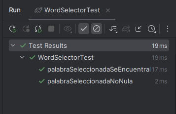
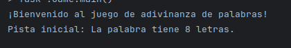
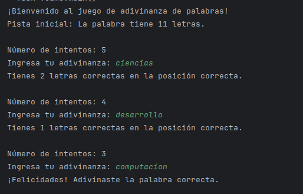
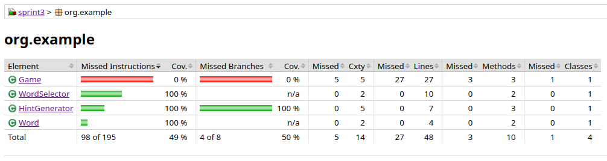

# Ejercicio 3

## Sprint 1

**Ubicacion: ** Ejercicio3.sprint1

Tareas:

* Configuración del entorno: Se configuró el proyecto añadiendo las dependencias necesarias para el mismo.

* Implementar pruebas básicas: Se implementó HintGeneratorTest y WordSelectorTest.

La imagen muestra los siguientes test:

Test para que si seleccionas una palabra esta no debe ser nula

Test para que si seleccionas una palabra esta debe estar dentro de la lista de palabras

* Crear la estructura inicial de clases y métodos: Se muestra los resultados en consola de lo aplicado.

El programa muestra un mensaje de bienvenida al usuario.

* Aplicar métricas de cohesión y LCOM

    * Acoplamiento eferente y aferente
    
            Clase: WordSelector Ce = 1 - Ca = 0
            CLase: HintGenerator Ce = 0 - Ca = 0

## Sprint 2

**Ubicacion: ** Ejercicio3.sprint2

Tareas: 

* Implementa la lógica para recibir adivinanzas del jugador: Se implementó la lógica dentro del método start() de la clase Game

* Genera y muestra retroalimentación: Dentro del método generateHint() de la clase HintGenerator se encuentra la retroalimentación brindada.

El programa te da 5 intentos, al ingresar una palabra te brinda retroalimentacion, diciendo cuantas letras correctas ingresaste.
Finalmente si aciertas te muestra un mensaje de felicitaciones.

* Realiza pruebas unitarias y de integración

* Refactoriza el código basado en métricas CAMC y LCOM4

    * CAMC: CAMC = [sumatorio de tipos de parámetros únicos utilizados por todos los métodos] /[número total de métodos× número máximo de parámetros por método.]

            Clase WordSelector CAMC no aplica, los metodos no utilizan parametros
            Clase HintGenerator CAMC = 2/(2*2) = 0.5

## Sprint 3

**Ubicacion: ** Ejercicio3.sprint3

Ejercicio 1: Se creó las interfaces IWordSelector y IHintGenerator

Ejercicio 2

Ejercicio 3: Aplica principios SOLID al código del juego

* SRP: Se cumple el principio de responsabilidad unica porque cada Clase tiene una responsabilidad única.

Por ejemplo: WordSelector está encargado unicamente de seleccionar una palabra aleatoria.

* DIP: Se cumple este principio ya que implementamos dos interfaces en el ejercicio 1.
* LSP: Se cumple este principio porque cada implementacion de las interfaces solo realiza lo que se espera, no hay efectos secundarios no deseados.
* OCP: Se cumple este principio porque as clases como Game, WordSelector, HintGenerator, e IWordSelector, IHintGenerator están diseñadas para ser 
extendidas sin modificar su comportamiento interno. Por ejemplo, si deseamos agregar nuevas formas de seleccionar palabras o generar pistas, podemos crear
nuevas clases que implementen IWordSelector o IHintGenerator sin necesidad de cambiar las clases existentes.
* ISP: Se cumple este principio porque las interfaces IWordSelector e IHintGenerator están diseñadas para proporcionar solo los métodos necesarios para las responsabilidades específicas.

Ejercicio 4: Aplicar TDD y Jacoco para desarrollar una nueva funcionalidad y refactorizar el código existente

Reporte: Jacoco

EL reporte de Jacoco muestra que tenemos una cobertura del 50%, sin embargo esto se debe a que
no he podido implementar los test para dicha clase, sin embargo las clases WordSelector, HintSelector y Word tienen 
una cobertura del 100%, esto se debe a que los test cubren todo el código.
