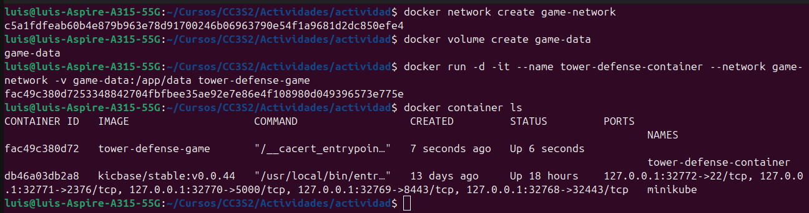
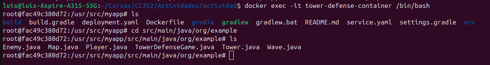
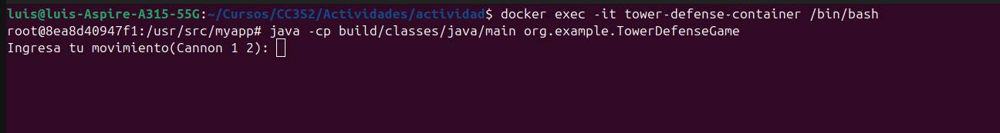
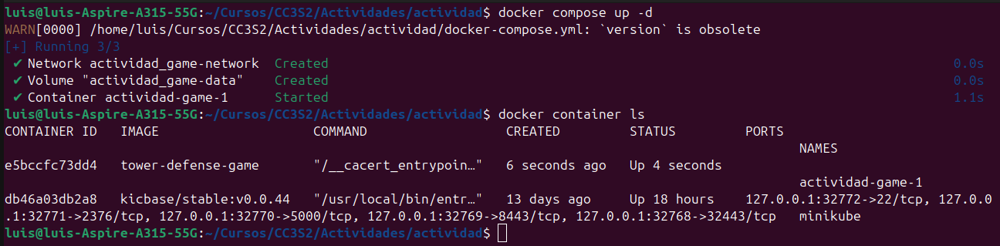
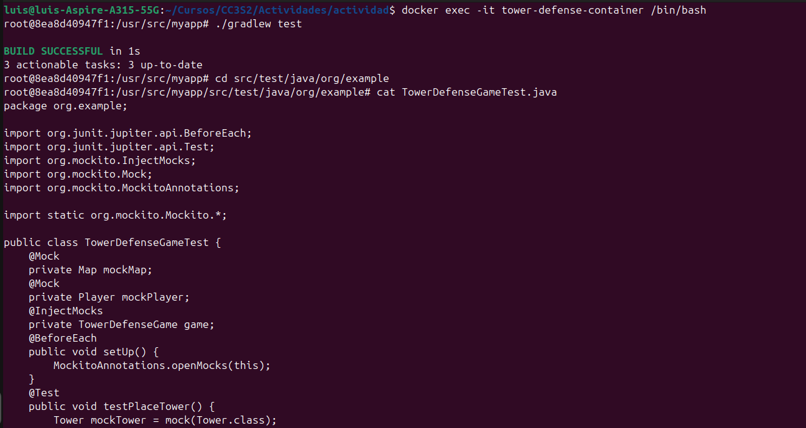
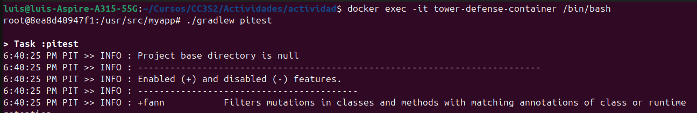
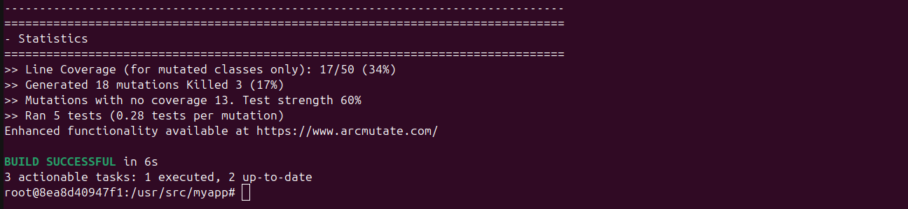
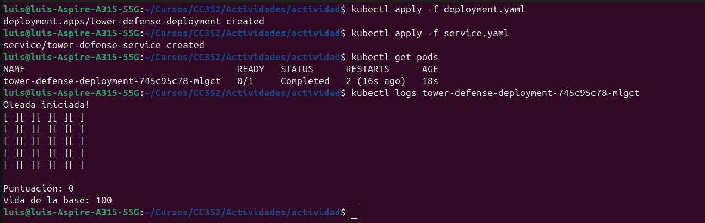

# Tower defense 

Nota: Estoy enfocando la solución de mi examen hacia el uso de Docker y Kubernetes especialmente.
No he podido implementar más pruebas por falta de tiempo, ya que trabajo; sin embargo, quiero demostrar que 
se pueden correr pruebas y generar el reporte de pitest dentro de mi contenedor.

## Ejercicio 1: Configuración y uso de docker

**Arquitectura docker**

Docker Client: es la interfaz principal a través de la cual los usuarios interactuan con Docker.

Docker Daemon: Es el servidor encargado de gestionar objetos Docker como contenedores, imágenes, volúmenes y redes.

Imágenes: Una imagen es una plantilla de solo lectura que contiene el código, las bibliotecas y las dependencias 
necesarias.

Contenedores: Un contenedor es una instancia de una imagen que se ejecuta en un entorno aislado.

Volumes: Los volúmenes son directorios que se montan en un contenedor y se utilizan para persistir datos.

Networking: Docker proporciona una red virtual que permite la comunicación entre contenedores y con el exterior.

**Docker vs. VMware/VirtualBox**

Ventajas

Docker es ligero, los contenedores Docker son mucho más livianos que una máquina virtual(Virtual Box).

Los contenedores Docker se inician mucho más rápido que las máquinas virtuales, ya que no necesitan arrancar un SO completo.

Los contenedores Docker son portables, estos se pueden ejecutar en cualquier máquina que tenga Docker instalado.

Los contenedores Docker se pueden escalar horizontalmente con facilidad.

Desventajas

Los contenedores Docker solo se pueden ejecutar en sistemas que tengan el mismo kernel que el sistema host.

Los contenedores no se encuentran aislados completamente del sistema host.

### Crear del archivo Dockerfile

Seleccionamos una imagen oficial de Gradle con JDK 17, versión 7.6.2.
Esto incluye todas las herramientas necesarias para construir y ejecutar proyectos Gradle con Java 17.
```dockerfile
FROM gradle:7.6.2-jdk17
```

Establecemos el directorio de trabajo dentro del contenedor en `/usr/src/myapp`. 
Todos los comandos siguientes se ejecutarán desde este directorio.
```dockerfile
WORKDIR /usr/src/myapp
```

Copiamos todos los archivos y directorios desde el host (el directorio actual en tu máquina local) 
al directorio de trabajo en el contenedor (/usr/src/myapp).
```dockerfile
COPY . /usr/src/myapp
```

Dar permisos de ejecución al Gradle Wrapper para poder usar `./gradlew build`
```dockerfile
RUN chmod +x gradlew
```

Ahora compilamos el proyecto junto con las pruebas.
```dockerfile
RUN ./gradlew build 
```

Finalmente, usamos `sh` para ejecutar las pruebas y si pasan ejecutamos el programa.
```dockerfile
CMD ["sh", "-c", "./gradlew test && java -cp build/classes/java/main org.example.TowerDefenseGame"]
```

### Creación de la imagen tower-defense-game

Ejecutamos el siguiente comando para poder crear una imagen llamada tower-defense-game.
```shell
docker build -t tower-defense-game .
```

### Creación de una red personalizada
Ejecutamos el siguiente comando para poder crear una red.
```shell
docker network create game-network
```

### Creación del volumen
Ejecutamos el siguiente comando para poder crear un volumen para persistir datos.
```shell
docker volume create game-data
```

### Creación del contenedor Docker
Ahora creamos el contenedor con la siguiente instrucción y hacemos que se ejecute en segundo plano con la bandera
`-d`.
```shell
docker run -d -it --name tower-defense-container --network game-network -v game-data:/app/data tower-defense-game
```

La siguiente imagen muestra la creación de la red, creación del volumen y también la creación del contenedor.
Se muestra que el contenedor está en ejecución con `docker container ls`.



### Utilizando el comando docker exec

```shell
docker exec -it tower-defense-container /bin/bash
```
Después de ejecutar la instrucción anterior podemos ver que nuestro contenedor funciona de manera correcta y podemos tener acceso
a él por medio de un bash. En la imagen navegamos hacia el directorio `org.example` que contiene nuestras clases. 



Utilizamos docker exec para utilizar un bash y poder ejecutar: `java -cp build/classes/java/main org.example.TowerDefenseGame`
y compilar el programa.
```shell
docker exec -it tower-defense-container /bin/bash
```
```shell
$ java -cp build/classes/java/main org.example.TowerDefenseGame
```

En la imagen podemos observar que el programa se logra ejecutar ingresando a un bash dentro del contenedor.



## Ejercicio 2: Redes y volúmenes en Docker

**Redes**

Bridge Network: Es la red predeterminada cuando Docker inicia un contenedor si no se especifica otra red.
Es adecuada para entornos donde los contenedores se comunican entre sí, pero no necesitan comunicarse con la red del Host.

Host Network: Es la red que permite que un contenedor use directamente la red del Host, el contenedor tiene acceso
directo a los puertos y la IP del host.

Overlay Network: La red overlay permite a los contenedores en diferentes hosts Docker comunicarse entre sí de manera segura y eficiente.

**Volumenes**

Volúmenes: Uso para datos persistentes que deben sobrevivir aún después de la eliminación de los contenedores.

Bind Mounts: Permiten montar un directorio específico del host en el contenedor.

### Configuración de docker-compose.yml

Configuramos el archivo docker-compose.yml para poder usar la imagen tower-defense-game, así como
también las redes y volúmenes anteriormente creados. El archivo mantiene la configuración brindada
en el examen.
```yaml
version: '3'
services:
  game:
    image: tower-defense-game
    networks:
      - game-network
    volumes:
      - game-data:/app/data
networks:
  game-network:
    driver: bridge
volumes:
  game-data:
    driver: local
```

Ejecutamos la instrucción para crear el contenedor con docker compose.

```shell
docker compose up -d
```

Luego de creado el contenedor mostramos los contenedores utilizando
```shell
docker container ls
```

La siguiente imagen muestra la creación del contenedor usando docker compose y los contenedores que están corriendo.



## Ejercicio 4: Pruebas unitarias y de integración con Mockito

Mocks: Son objetos que simulan el comportamiento de objetos reales de la aplicación.

Stubs: Son objetos que proporcionan respuestas predefinidas a llamadas de métodos u objetos durante las pruebas.

Fakes: Son implementaciones simples de interfaces o clases que simulan el comportamiento de componentes reales.

Las pruebas unitarias se implementaron para la clase `TowerDefenseGame`, por falta de tiempo se implementó los test 
brindados en el examen.

Creamos Mock de las clases Map, Player. 

Inyectamos los mocks a la clase TowerDefenseGame.

El método `testPlaceTower()` verifica que al llamar al método `placeTower` en `TowerDefenseGame`, el método correspondiente 
en Map es invocado con los argumentos correctos, utilizando mocks para simular los objetos Map, Player, y Tower.
```java
public class TowerDefenseGameTest {
    @Mock
    private Map mockMap;
    @Mock
    private Player mockPlayer;
    @InjectMocks
    private TowerDefenseGame game;
    @BeforeEach
    public void setUp() {
        MockitoAnnotations.openMocks(this);
    }
    @Test
    public void testPlaceTower() {
        Tower mockTower = mock(Tower.class);
        game.placeTower(mockTower, 2, 2);
        verify(mockMap).placeTower(mockTower, 2, 2);
    }
}
```

Ahora ejecutamos las pruebas dentro de nuestro contenedor, primero abrimos un bash en nuestro contenedor.

```shell
docker exec -it tower-defense-container /bin/bash
```

Una vez en el bash podemos ejecutar `./gradlew test` ya que nuestro contenedor utiliza la imagen de gradlew.

```shell
./gradlew test
```

En la siguiente imagen podemos ver la ejecución de las instrucciones anteriores, además nos hemos dirigido
a la ubicación del código de test y lo mostramos para verificar que existe el código en nuestro contenedor.



## Ejercicio 5: Pruebas de mutación

**Pruebas de mutación**

Son una técnica de testing de caja blanca, estas se utilizan para evaluar la calidad de las pruebas existentes 
introduciendo de manera deliberada cambios(mutaciones) al código fuente de la aplicación.

Algunos ejemplos de operadores de mutación:

* Operadores aritméticos: Reemplazar "+" por "-" o reemplazar "*" por "/".
Su propósito es verificar que las pruebas detectan errores en cálculos aritméticos.
* Operadores relacionales: Reemplazar "==" por "!=" o reemplazar "<" por ">".
Su propósito es verificar que las pruebas detecten errores en comparaciones lógicas.

**Tasa de mutación**

La tasa de mutación o mutation score, es una métrica utilizada para evaluar la efectividad del conjunto de pruebas.

Fórmula: 

Tasa de mutación = (Número de mutantes detectados / Número total de mutantes)*100

**Cobertura de mutación**

La cobertura de mutación, es una métrica utilizada para evaluar la cantidad de código que está siendo afectado por las mutaciones.

Fórmula:

Cobertura de mutación: (Número de líneas de código modificadas / Número total de líneas de código)*100

### Generando el reporte de Pitest

Primero vamos a ejecutar `docker exec` para poder tener un bash y ejecutar pitest, hay que tener en cuenta 
que las dependencias de pitest ya se encuentran dentro del contenedor en el archivo `build.gradle`.

```shell
docker exec -it tower-defense-container /bin/bash
```
```shell
./gradlew pitest
```

Las siguientes imágenes muestran la manera en que ejecuté pitest en mi contenedor y también las estadísticas del reporte.

Según el reporte tenemos 18 mutantes, de los cuales 3 han sido matados obteniendo una cobertura del 17%.





## Ejercicio 3: Orquestación con Kubernetes

API Server: Es el componente central de Kubernetes que actúa como punto de entrada para la gestión del clúster.

etcd: Es un almacén de datos distribuido y consistente, guarda información crucial como la configuración de los nodos y servicios del clúster.

Scheduler: Asigna recursos a los contenedores y decide en qué nodo del clúster deben ejecutarse.

Kubelet: Es un agente que se ejecuta en cada nodo del clúster y se comunica con el API Server.
Gestiona los contenedores del nodo.

### Subir nuestra imagen a Docker hub

Iniciamos sesión en Docker hub para poder subir nuestra imagen
```shell
docker login
```

A nuestra imagen le damos una etiqueta adecuada para poder subirla.
```shell
docker tag tower-defense-game:latest luisjhonatan/tower-defense-game:1
```

Hacemos un push a nuestra imagen.
```shell
docker push luisjhonatan/tower-defense-game:1
```

### Crear el archivo deployment.yaml

Especificamos la versión de la API de Kubernetes, en este caso `apps/v1`.

Indicamos el tipo de objeto que estamos creando, en este caso `Deployment`.

Definimos metadatos del objeto, como el nombre (`name`).

Por último definimos las características deseadas para el objeto.
```yaml
apiVersion: apps/v1
kind: Deployment
metadata:
  name: tower-defense-deployment
spec:
  replicas: 1
  selector:
    matchLabels:
      app: tower-defense-game
  template:
    metadata:
      labels:
        app: tower-defense-game
    spec:
      containers:
        - name: tower-defense-game
          image: luisjhonatan/tower-defense-game:1
          resources:
            requests:
              memory: "256Mi"
              cpu: "250m"
            limits:
              memory: "512Mi"
              cpu: "500m"
          ports:
            - containerPort: 8080
```

### Crear el archivo service.yaml

```yaml
apiVersion: v1
kind: Service
metadata:
  name: tower-defense-service
spec:
  selector:
    app: tower-defense-game
  ports:
    - protocol: TCP
      port: 80
      targetPort: 8080
  type: LoadBalancer
```

Nota: la imagen está subida a mi repositorio de docker hub.

[Image tower-defense-game:1](https://hub.docker.com/repositories/luisjhonatan)

## Aplicar los archivos de configuración en Kubernetes

Las siguientes instrucciones van a aplicar los archivos deployment.yaml y service.yaml a kubernetes.
```shell
kubectl apply -f deployment.yaml
```
```shell
kubectl apply -f service.yaml
```

Después de ellos verificamos los pods y nos dirigimos hacia los logs para ver nuestro programa.

```shell
kubectl get pods
```

```shell
kubectl logs tower-defense-deployment-745c95c78-mlgct
```

En la siguiente imagen mostramos lo mencionado anterior. Aquí podemos observar el estado de nuestro pod
y también los log del mismo.

