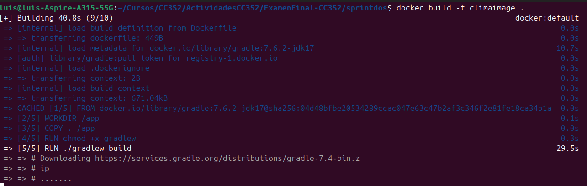
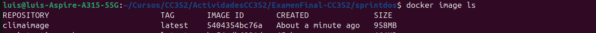
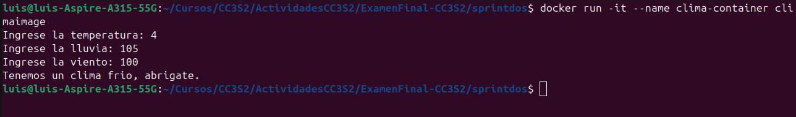
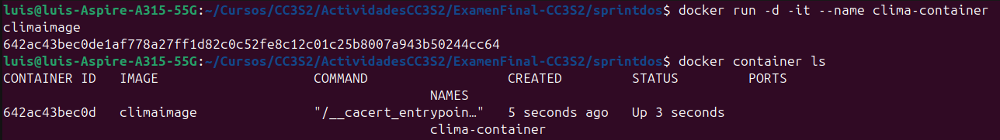
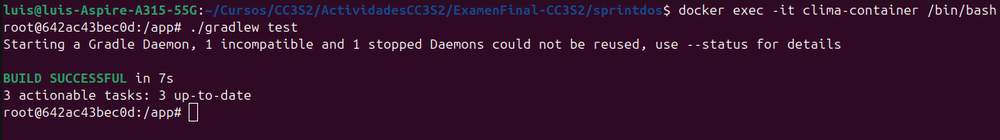
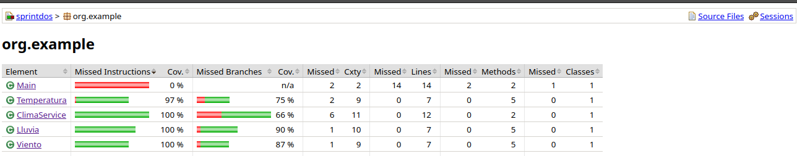
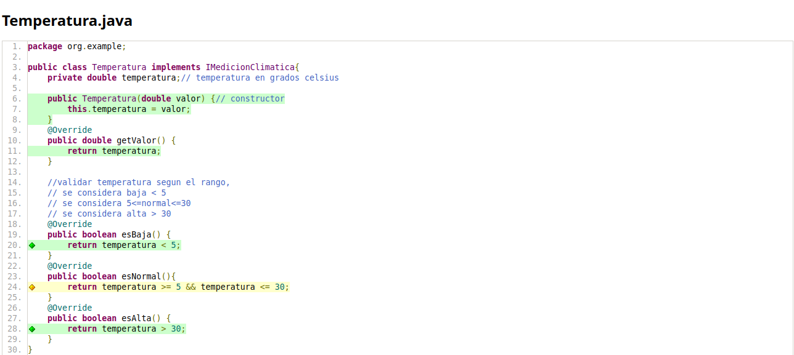
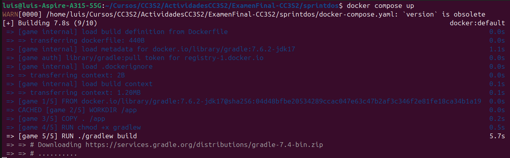

# Sprint 2

## Creando el Dockerfile

Creamos el Dockerfile de la siguiente manera:

```dockerfile
FROM gradle:7.6.2-jdk17

# establecemos el directorio de trabajo
WORKDIR /app

# copiamos los archivos al directorio de trabajo
COPY . /app

# Dar permisos de ejecución al Gradle Wrapper
RUN chmod +x gradlew

# Compilar el proyecto y ejecutar las pruebas usando el Gradle Wrapper
RUN ./gradlew build

# Ejecutar el programa compilado
CMD ["java", "-cp", "build/classes/java/main", "org.example.Main"]
```

Ahora construimos la imagen tomando en cuenta el Dockerfile

`docker build -t climaimage .`

Esperamos que termine de descargar lo necesario para construir nuestra imagen.



Ahora listamos nuestras imagenes para verificar que se haya creado exitosamente.

`docker image ls`



Creamos nuestro contenedor a partir de nuestra imagen `climaimage`

`docker run -it --name clima-container climaimage`

Como vemos nuestro contenedor se creó y podemos interactuar con él. Obtenemos la respuesta esperada
para una baja temperatura, un dia lluvioso y vientos fuertes.



Ahora volvemos a crear nuestro contenedor pero en segundo plano, para evitar que este se cierre
y poder ejecutar las pruebas. También mostramos los contenedores en ejecución.

`docker run -d -it --name clima-container climaimage`

`docker container ls`



Abrimos un terminal en nuestro contenedor para ejecutar nuestras pruebas.

`docker exec -it clima-container /bin/bash`

Para ejecutar nuestras pruebas hacemos:

`./ gradlew test`

Como se ve en la siguiente imagen las pruebas pasaron de manera correcta, estas pruebas ya incluyen
mockito como se pide. Los mocks y stubs funcionan correctamente en nuestro entorno contenerizado.



## Implementación de más test para aumentar la cobertura de código

Se implementaron test para las clases Temperatura, Lluvia y Viento. Se mostrará el reporte de JaCoCo para verificar que la
cobertura aumentó.



Notamos que la cobertura aumentó, sin embargo, la cobertura de ramas aún no llega al 100%.
Esto debido a que hay condiciones que nose consideran en las pruebas. Como por ejemplo:



En la imagen anterior notamos que hace falta considerar alguna condición extra en el método esNormal() para que nuestra
cobertura de ramas sea del 100%.

## Docker compose

```yaml
version: '3'
services:
  clima:
    build: .
    networks:
      - clima-network
    volumes:
      - clima-data:/app/data
    container_name: clima-app-container
    stdin_open: true # Habilita la entrada interactiva
    tty: true # Asigna un pseudo-TTY

networks:
  clima-network:
    driver: bridge

volumes:
  clima-data:
    driver: local
```

Descripción:

- **services**: Define un servicio llamado `clima`:
    - **build**: Construye la imagen del contenedor desde el Dockerfile en el directorio actual.
    - **networks**: Conecta el contenedor a una red llamada `clima-network`.
    - **volumes**: Monta un volumen llamado `clima-data` en `/app/data` dentro del contenedor, útil para persistir datos.
    - **container_name**: El nombre del contenedor se establece como `clima-app-container`.

- **networks**: Define una red llamada `clima-network`:
    - **driver**: Usa el driver `bridge` para la red, permitiendo que los contenedores conectados se comuniquen entre sí en una red aislada.

- **volumes**: Define un volumen llamado `clima-data`:
    - **driver**: Usa el driver `local` para el volumen, almacenando los datos en el host local.

Vamos a poner en marcha nuestro contenedor:

`docker compose up`

Esperamos a que termine de descargar lo necesario y configurar 

